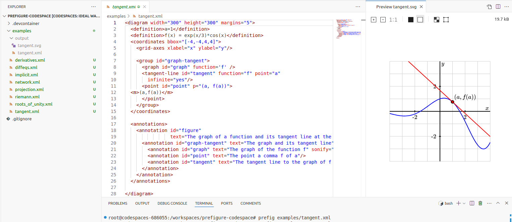

# PreFigure Codespace

[PreFigure](https://prefigure.org) is an authoring system for accessible mathematical diagrams.  This repository defines a template for users to create diagrams in the cloud using GitHub Codespaces.  

## Instructions

Follow these instructions to get started.

1. You will need to create a free [GitHub](https://github.com) account, if you do not already have one. 
2. From the green "Use this template" button in the upper-right corner of this page, select "Create a new repository", give your repository a name, and select "Create Repository".  You will be able to save your PreFigure source and diagrams into this repository and revisit at a later time so take note of the name you give your repository.
3. In your browser, navigate to your repository and, using the tab on the green "Code" button that says "Codespaces", select "Create a repository on main".

GitHub will then begin setting up your Codespace.  This process takes a few minutes the first time;  when you revisit your Codespace later, it will load much faster.  Once your Codespace has been created, VS Code will open in your browser and you can begin to create PreFigure diagrams.

After a period of inactivity, your Codespace will be stopped.  But don't worry:  all your work is still there.  Just use the green button to restart your Codespace, and you'll be able to pick up where you left off.  You will also be able to access this Codespace from a different browser or different machine.

## Using PreFigure

1. Rather than reading documentation, many of us learn a new authoring system by modifying existing examples, a set of which is provided in the `examples` folder.  To compile PreFigure source into an SVG diagram, use

    ```
    prefig build foo.xml
    ```

    or

    ```
    prefig build -f tactile foo.xml
    ```

    to create a tactile diagram.  In particular, you could compile one of the example source files with

    ```
    prefig build examples/tangent.xml
    ```

2. The resulting SVG diagram and annotations will appear in a directory called `output` inside the `examples` folder.  You may view the diagram by right-clicking on the output `tangent.svg` and selecting `Open Preview`.  If you change the PreFigure source and recompile, the preview will usually, but not reliably, update.

    Users could configure their working environment as shown in the image below.

    

    To explore the diagram with annotations, use

    ```
    prefig view tangent
    ```

    This will open a new window in your browser and display the SVG diagram using the `diagcess` library.  You may click on the image and use arrow keys to explore the diagram with annotations.

3. A folder `source` is provided as a convenient place for your own PreFigure source.

4. Help is available with

    ```
    prefig --help
    ```

    and

    ```
    prefig view --help
    ```

## Beginning steps

Here are some explorations that you could use to learn more.

1. Open the source file `tangent.xml`.
2. Add an attribute `stroke="green"` to the `graph` element and recompile to change the color of the graph to green.
3. Create a tactile version of the diagram.
3. Add a second tangent line at the point `b=-1`.
4. Change the bounding box so that the lower-left corner is (-5,5) and the upper-right is (5,5).
5. Add a second function to the diagram.
6. Modidy the annotations and examine the changes with `prefig view tangent` or by reloading the page if you are already viewing in a browser.
6. Investigate some of the other diagrams in the `examples` directory.

## Useful links

- [PreFigure documentation](https://prefigure.org/docs)
- [PreFigure homepage](https://prefigure.org)

## Contact

PreFigure is still very much a work in progress, and your feedback would be most helpful.


David Austin
